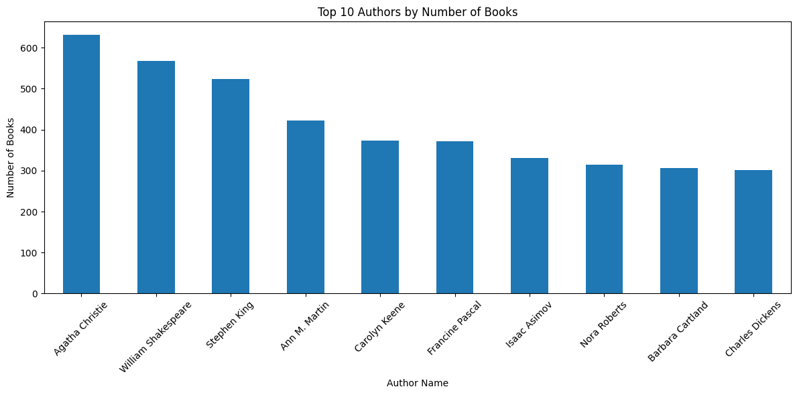

# Laporan Submission Sistem Rekomendasi - Najwa Tiara Djunaedy Putri

## Project Overview
### Latar Belakang
Di era digital yang terus berkembang, jumlah koleksi buku yang tersedia secara daring semakin melimpah. Hal ini memberikan keleluasaan bagi pembaca untuk memilih literatur sesuai minatnya, namun juga memunculkan tantangan baru yaitu cara menemukan buku yang paling relevan dan sesuai dengan preferensi pengguna secara cepat dan efisien. Dalam konteks ini, sistem rekomendasi buku menjadi solusi penting.

Salah satu pendekatan yang umum digunakan dalam sistem rekomendasi adalah content-based filtering, yakni metode yang merekomendasikan item berdasarkan kemiripan atribut konten antar item. Dalam konteks buku, atribut tersebut dapat berupa judul, penulis, genre, sinopsis, hingga kata kunci. Content-based filtering memungkinkan sistem memberikan rekomendasi yang personal karena disesuaikan dengan karakteristik buku yang pernah disukai atau dibaca oleh pengguna sebelumnya.

Berdasarkan penelitian yang dilakukan oleh Upreti *dkk* (2025), sistem rekomendasi berbasis konten dapat ditingkatkan performanya dengan menggunakan teknik representasi vektor dan metrik kesamaan seperti cosine similarity. Mereka menyatakan bahwa pendekatan ini efektif dalam menyusun daftar buku yang memiliki karakteristik serupa, sekaligus mampu beradaptasi terhadap preferensi individual pengguna.

Penelitian tersebut juga menunjukkan bahwa meskipun content-based filtering memiliki keterbatasan, integrasinya dalam sistem rekomendasi, baik secara tunggal maupun sebagai bagian dari pendekatan hybrid, mampu memberikan hasil yang cukup akurat dalam mempersonalisasi rekomendasi. Oleh karena itu, pengembangan sistem rekomendasi buku berbasis content-based filtering tetap relevan dan signifikan, terutama jika dioptimalkan dengan preprocessing data yang tepat, pemilihan fitur yang informatif, dan penggunaan algoritma pemodelan kesamaan antar item yang efisien.

### Hasil Riset Referensi
Penelitian yang dilakukan oleh Upreti *dkk* (2025) membuktikan bahwa sistem rekomendasi berbasis content-based filtering menjadi metode yang efektif dalam memberikan rekomendasi buku kepada pengguna berdasarkan karakteristik konten buku yang telah mereka baca atau sukai sebelumnya.

Penelitian ini membangun sistem rekomendasi menggunakan pendekatan TF-IDF (Term Frequency-Inverse Document Frequency) untuk merepresentasikan fitur dari setiap buku, khususnya pada bagian judul dan metadata. Setelah fitur vektor dari tiap buku diperoleh, sistem menggunakan cosine similarity untuk mengukur tingkat kemiripan antar buku. Semakin tinggi nilai cosine similarity antara dua vektor buku, semakin besar kemungkinan sistem akan merekomendasikannya kepada pengguna.

Pengujian dilakukan pada dataset yang memuat judul buku dan informasi terkait lainnya. Hasil pengujian menunjukkan bahwa metode ini dapat menghasilkan rekomendasi yang cukup relevan, terutama untuk pengguna yang telah memiliki histori bacaan sebelumnya. Dalam percobaan yang dilakukan, sistem mampu menyarankan buku-buku yang secara semantik memiliki keterkaitan dengan buku input dari pengguna.

Selain keunggulan tersebut, penelitian ini juga mengidentifikasi beberapa keterbatasan dari pendekatan content-based filtering, antara lain:
- Kurangnya keberagaman (over-specialization): sistem cenderung merekomendasikan buku-buku yang sangat mirip dengan buku sebelumnya, sehingga eksplorasi buku baru menjadi terbatas.
- Masalah cold start: sistem kesulitan memberikan rekomendasi untuk pengguna baru (yang belum memiliki riwayat bacaan) atau buku baru (yang belum memiliki cukup informasi).
- Ketergantungan pada kualitas data konten: sistem sangat tergantung pada informasi metadata (judul, penulis, deskripsi) untuk menghasilkan rekomendasi yang akurat.

Referensi: Upreti *dkk*. (2025). A Book Tracking and Recommender System using Machine Learning Algorithms. *International Journal for Research in Applied Science & Engineering Technology (IJRASET)*, 13(5), 2377-2385. https://doi.org/10.22214/ijraset.2025.70694

### Mengapa Proyek Ini Penting Untuk Diselesaikan
1. Membantu pengguna menemukan buku yang sesuai dengan preferensinya. Dengan semakin banyaknya pilihan buku yang tersedia secara daring, pengguna sering kali merasa kewalahan dalam menentukan bacaan yang tepat. Proyek sistem rekomendasi ini bertujuan untuk menyederhanakan proses tersebut dengan menyajikan daftar buku yang paling relevan berdasarkan buku yang pernah dibaca atau disukai pengguna. Hal ini menjadikan pengalaman mencari buku lebih personal, efisien, dan menyenangkan.
2. Meningkatkan efisiensi sistem pencarian buku. Tanpa sistem rekomendasi, pengguna harus menggunakan fitur pencarian manual yang terbatas pada kata kunci tertentu, yang belum tentu mencerminkan keseluruhan minat mereka. Dengan memanfaatkan content-based filtering, sistem dapat mengidentifikasi kemiripan antar buku dan secara otomatis menyarankan bacaan yang relevan, sehingga mengurangi waktu pencarian dan meningkatkan akurasi hasil yang diberikan.
3. Memberikan personalisasi dalam pengalaman membaca. Personalisasi merupakan salah satu kunci utama dalam meningkatkan keterlibatan dan kepuasan pengguna. Sistem rekomendasi dalam proyek ini secara otomatis menyesuaikan saran buku berdasarkan pola preferensi unik tiap individu, bukan hanya berdasarkan buku populer secara umum. Ini memungkinkan setiap pengguna memperoleh pengalaman yang berbeda dan lebih sesuai dengan kebutuhannya masing-masing.
4. Menjadi dasar pengembangan sistem hybrid yang lebih kompleks. Content-based filtering dapat dijadikan sebagai pondasi awal untuk membangun sistem rekomendasi yang lebih kompleks, seperti pendekatan hybrid yang menggabungkan content-based dan collaborative filtering. Dengan menyelesaikan proyek ini, diperoleh kerangka kerja yang bisa dikembangkan lebih lanjut untuk menangani berbagai tantangan seperti cold-start problem atau over-specialization, yang umum terjadi dalam sistem rekomendasi.

### Bagaimana Proyek Ini Diselesaikan
1. Pengumpulan dan Persiapan Dataset. Dataset yang digunakan diperoleh dari Kaggle, yaitu Book Recommendation Dataset yang terdiri atas tiga file utama: Books.csv, Ratings.csv, dan Users.csv. Dataset tersebut mencakup informasi judul buku, ISBN, nama pengarang, penerbit, tahun terbit, serta data rating yang diberikan oleh pengguna terhadap buku-buku tersebut.
2. Eksplorasi dan Pembersihan Data. Data dari masing-masing file dibaca menggunakan pustaka pandas. Kemudian dilakukan eksplorasi awal terhadap jumlah ISBN unik, pengguna, serta karakteristik buku seperti jumlah pengarang dan penerbit. Selain itu, dilakukan pembersihan data seperti penghapusan data duplikat dan konversi kolom tahun terbit ke tipe numerik (int) untuk menghindari error pemrosesan.
3. Pemilihan dan Representasi Fitur Buku. Dalam pendekatan content-based filtering, fitur yang digunakan untuk merepresentasikan buku adalah Book-Author. Fitur ini kemudian diubah menjadi vektor numerik menggunakan teknik TF-IDF (Term Frequency–Inverse Document Frequency) melalui TfidfVectorizer dari Scikit-Learn. Teknik ini menghasilkan matriks TF-IDF yang menggambarkan pentingnya kata dalam konteks seluruh koleksi buku.
4. Perhitungan Kemiripan Antar Buku. Setelah mendapatkan representasi vektor buku, dilakukan perhitungan kemiripan antar buku menggunakan cosine similarity. Matriks kemiripan yang dihasilkan digunakan untuk menentukan tingkat kesamaan antara satu buku dengan buku lainnya berdasarkan informasi penulis.
5. Pembangunan Sistem Rekomendasi Buku. Sistem rekomendasi dibangun dengan memanfaatkan hasil cosine similarity. Untuk buku yang telah dibaca pengguna, sistem akan merekomendasikan buku lain yang memiliki nilai kemiripan tertinggi. Proses ini dibungkus dalam fungsi book_recommendation() yang mampu memberikan daftar buku mirip berdasarkan input judul buku tertentu.
6. Visualisasi dan Validasi Output Rekomendasi. Proyek juga mencakup pembuatan visualisasi seperti distribusi rating dan analisis pengguna aktif, serta menampilkan output rekomendasi yang dihasilkan. Selain itu, sistem memeriksa kondisi khusus, seperti pengguna yang telah membaca semua buku dalam dataset, guna menghindari error saat prediksi.

## Business Understanding
### Problem Statements
1. Bagaimana membangun sistem rekomendasi buku yang mampu memberikan saran bacaan yang relevan kepada pengguna berdasarkan konten buku? Banyaknya pilihan buku dalam platform digital seringkali menyulitkan pengguna dalam menemukan bacaan yang sesuai dengan minat mereka. Diperlukan sistem yang dapat membantu pengguna menavigasi pilihan tersebut berdasarkan karakteristik konten buku.
2. Bagaimana cara merepresentasikan informasi konten buku dalam bentuk fitur numerik agar dapat dibandingkan satu sama lain secara otomatis? Untuk menerapkan content-based filtering, perlu dilakukan proses ekstraksi fitur seperti nama pengarang atau judul buku yang selanjutnya dapat dikonversi ke bentuk numerik menggunakan metode seperti TF-IDF.
3. Bagaimana mengukur tingkat kemiripan antar buku secara akurat agar sistem dapat memberikan rekomendasi yang tepat? Sistem perlu menerapkan metrik kesamaan (similarity) yang efektif, seperti cosine similarity, agar dapat mengidentifikasi buku yang paling mirip dengan preferensi pengguna sebelumnya.
### Goals
1. Membangun sistem rekomendasi buku berbasis konten. Tujuan utama dari proyek ini adalah membangun sistem yang dapat merekomendasikan buku kepada pengguna berdasarkan konten buku itu sendiri, seperti judul atau nama pengarang. Ini menjawab kebutuhan pengguna dalam menemukan bacaan yang sesuai tanpa harus bergantung pada popularitas atau rating dari pengguna lain.
2. Mengekstraksi dan merepresentasikan informasi konten dalam bentuk vektor numerik. Sistem dirancang untuk mengubah informasi teks (seperti nama pengarang) menjadi bentuk numerik menggunakan metode TF-IDF (Term Frequency–Inverse Document Frequency). Representasi ini memungkinkan sistem untuk mengukur hubungan antar buku secara matematis.
3. Mengimplementasikan pengukuran kemiripan antar buku menggunakan cosine similarity. Proyek ini bertujuan untuk menghitung tingkat kemiripan antar buku berdasarkan vektor kontennya, dengan menggunakan cosine similarity sebagai metrik utama. Metrik ini membantu sistem menentukan buku yang paling mirip untuk direkomendasikan.
### Solution Statements
1. Untuk membangun sistem rekomendasi buku berbasis konten, solusi yang diterapkan adalah dengan menggunakan pendekatan content-based filtering, di mana sistem merekomendasikan buku berdasarkan kesamaan konten antar buku. Implementasi dimulai dengan memilih fitur penting dari buku, seperti judul atau nama pengarang, lalu membandingkannya untuk menemukan buku yang paling relevan bagi pengguna.
2. Untuk mengekstraksi dan merepresentasikan informasi konten dalam bentuk vektor numerik, sistem memanfaatkan teknik Term Frequency–Inverse Document Frequency (TF-IDF). Teknik ini digunakan untuk mengubah data teks (contohnya: nama pengarang) menjadi representasi angka dalam bentuk matriks TF-IDF, yang dapat diproses secara komputasional. Hasil representasi ini akan digunakan sebagai dasar dalam penghitungan kemiripan antar buku.
3. Untuk mengimplementasikan pengukuran kemiripan antar buku menggunakan cosine similarity, sistem melakukan komputasi cosine similarity terhadap vektor TF-IDF dari seluruh buku. Cosine similarity digunakan karena kemampuannya dalam mengukur sudut antar vektor dan menentukan tingkat kemiripan antar dua item teks, terlepas dari panjang dokumennya. Buku dengan nilai similarity tertinggi terhadap buku yang telah dibaca pengguna akan dipilih sebagai rekomendasi.

## Data Understanding
Dataset yang digunakan dalam proyek ini berasal dari Kaggle yang terdiri dari tiga file utama:
1. Books.csv: Setiap buku diidentifikasi berdasarkan ISBN masing-masing. File ini memiliki 8 fitur yang memberikan informasi setiap buku. Fitur-fitur yang tersedia yaitu ISBN buku (ISBN), judul buku (Book-Title), pengarang buku (Book-Author), tahun terbit buku (Year-Of-Publication), penerbit buku (Publisher), gambar buku ukuran kecil (Image-URL-S), gambar buku ukuran sedang (Image-URL-M), dan gambar buku ukuran besar (Image-URL-L)
2. Ratings.csv: Berisi informasi tentang peringkat atau penilaian buku yang diberikan oleh pengguna berskala 1-10. File ini memiliki 3 fitur, yaitu ID pengguna (User-ID), identitas buku berupa ISBN (ISBN), dan penialian buku dari pengguna (Book-Rating).
3. Users.csv: Berisi informasi mmengenai pengguna. Terdiri dari 3 fitur, yaitu ID pengguna (User-ID), lokasi pengguna (Location), dan usia pengguna (Age).

Tautan dataset: https://www.kaggle.com/datasets/arashnic/book-recommendation-dataset/data

### Exploratory Data Understanding
**A. Book Variabel**
1. books.info(): Memberikan informasi mengenai file books.csv. Seluruh fitur memiliki tipe object.
2. len(books.Fitur.unique()): Menghitung jumlah data tiap nilai unique setiap fitur. Hasilnya berupa:
   * Banyak data buku:  271360
   * Jumlah Judul Buku:  242135
   * Jumlah Pengarang:  102023
   * Banyak Tahun Terbit:  202
   * Jumlah Penerbit:  16808
3. Visualisasi bar chart top 10 author yang menunjukkan 10 pengarang dengan jumlah buku terbanyak

   Berikut top 10 author:
   * Agatha Christie
   * William Shakespeare
   * Stephen King
   * Ann M. Martin
   * Carolyn Keene
   * Francine Pascal
   * Isaac Asimov
   * Nora Roberts
   * Barbara Cartland
   * Charles Dickens

**B. Rating Variabel**
1. ratings.info(): Memberikan informasi mengenai file ratings.csv. Terdapat 2 fiutr bertipe integer dan 1 fitur bertipe object.
2. ratings.describe(): Memberikan analisis deskriptif terhadap fitur integer. Rating berskala 0-10, dengan minimal rating yaitu 0 dan maksimal rating yaitu 10.
3. len(ratings.Fitur.unique()): Menghitung jumlah data tiap nilai unique setiap fitur. Hasilnya berupa:
   * Jumlah pengguna yang memberikan rating:  105283
   * Jumlah buku yang dirating:  340556
   * Jumlah data rating:  1149780

Cek missing value pada data merge books_rat dengan isnull().sum(). Jumlah nilai null tiap fitur:
  * ISBN: 0
  * Book-Title: 0
  * Book-Author: 2
  * Year-Of-Publication: 4
  * Publisher: 2
  * Image-URL-S: 0
  * Image-URL-M: 0
  * Image-URL-L: 4
  * User-ID: 1209
  * Book-Rating: 1209

Cek nilai duplikat data merge books_rat dengan duplicated().sum(): Tidak terdapat nilai duplikat

Tidak melakukan eksplorasi data terhadap users.csv karena dalam content based filtering hanya menggunakan books.csv dan ratings.csv.

## Data Preparation
1. Menggabungkan books dengan ratings berdasarkan ISBN

   Proses: Menggunakan metode merge() dengan on='ISBN'.

   Alasan: Agar setiap entri buku memiliki informasi rating yang terkait, sehingga bisa digunakan dalam proses pemodelan atau evaluasi sistem rekomendasi.
2. Mengubah tipe data Year-Of-Publication menjadi tipe numerik

   Proses: Menggunakan metode pd.to_numeric dengan errors='coerce'

   Alasan: Entri tahun berisi teks sehingga perlu dikonversi agar dapat diolah (misalnya digunakan sebagai fitur atau filter). errors='coerce' akan menjadikan nilai tidak valid sebagai NaN.
3. Hapus baris yang mengandung missing value

   Proses: Menggunakan metose dropna(). Menghapus semua baris yang memiliki nilai kosong pada salah satu kolom.

   Alasan: Nilai kosong dapat menyebabkan error pada proses berikutnya, terutama saat melakukan transformasi atau perhitungan seperti cosine similarity.
4. Drop fitur yang tidak digunakan

   Proses: Menggunakan metode drop() pada fitur Image-URL-S, Image-URL-M, dan Image-URL-L

   Alasan: Untuk menyederhanakan data dan fokus pada fitur penting seperti Book-Title, Book-Author, rating, dan ISBN. Fitur gambar atau URL tidak digunakan dalam content-based filtering.
5. Mengubah tipe data Year-Of-Publication menjadi integer

   Proses: Menggunakan metode astype(int)

   Alasan: Untuk menampilkan tipe data tahun yang seharusnya, bukan float tetapi integer.
6. Mengurutkan data berdasarkan ISBN

   Proses: Menggunakan metode sort_values by='ISBN' dan ascending=True.

   Alasan: Pengurutan membantu dalam proses debugging, pencarian duplikat, atau validasi data, terutama ketika akan dilakukan penghapusan duplikat.
7. Menghapus baris yang mengandung ISBN duplikat

   Proses: Menggunakan metode drop_duplicates dengan subset='ISBN'

   Alasan: Untuk memastikan setiap buku hanya muncul satu kali dalam dataset. Duplikasi dapat menyebabkan bias dalam sistem rekomendasi.
8. Mengubah tipe data ke bentuk list

   Proses: Menggunakan metode tolist() untuk mengubah tipe data menjadi list.

   Alasan: List digunakan untuk mapping dan encoding ke format numerik dalam proses pembuatan model rekomendasi
9. Membuat dataframe baru dan mengambil 20000 data pertama

   Proses: Menggunakan pd.DataFrame untuk mebuat dataframe baru dari list yang sudah dibuat dan [:20000] untuk mengambil 20000 data pertama pada dataframe.

   Alasan: Untuk efisiensi pemrosesan dan pelatihan model. Dataset asli sangat besar, sehingga sampling dilakukan untuk mempercepat proses eksplorasi, pelatihan, dan evaluasi tanpa mengurangi representasi data secara signifikan.
10. TF-IDF Vectorizer

    Proses: Objek TfidfVectorizer dari pustaka Scikit-Learn diinisialisasi untuk memproses teks yang akan diubah menjadi representasi vektor. Objek ini bertanggung jawab melakukan tokenisasi, menghitung TF dan IDF, dan membentuk matriks TF-IDF. Kemudian dilakukan pelatihan awal (fit) pada data teks dari kolom author. Proses ini menghitung nilai IDF untuk setiap token (kata) unik dalam korpus Book-Author. Tujuannya adalah untuk mengetahui seberapa penting suatu kata dalam keseluruhan kumpulan data. Selanjutnya, ditampilkan daftar fitur atau kata unik yang dihasilkan dari proses tokenisasi Book-Author. Setiap kata akan menjadi kolom dalam matriks TF-IDF.

   Setelah proses fit, data teks kemudian diubah menjadi bentuk matriks TF-IDF. Matriks ini memiliki dimensi (jumlah_buku × jumlah_kata_unik), di mana setiap sel berisi bobot TF-IDF dari kata tertentu untuk masing-masing buku (berdasarkan nama pengarang). Matriks TF-IDF hasil transformasi awal berbentuk sparse matrix. Untuk keperluan analisis atau visualisasi, sparse matrix diubah ke bentuk dense agar setiap elemen dapat ditampilkan secara eksplisit. Kemudian, dibuat dataframe agar lebih mudah dalam melakukan eksplorasi dan interpretasi terhadap matriks TF-IDF. Kolom diisi dengan penulis buku dan baris diisi dengan judul buku.
   
    Alasan: TF-IDF (Term Frequency–Inverse Document Frequency) digunakan untuk mengubah fitur teks (dalam proyek ini: nama pengarang/'author') menjadi bentuk numerik (vektor). Setiap kata dalam nama pengarang akan dihitung bobotnya berdasarkan frekuensinya dalam satu buku dan seberapa umum kata tersebut muncul di keseluruhan data. Representasi vektor hasil TF-IDF ini digunakan untuk menghitung seberapa mirip dua buku berdasarkan penulisnya. Semakin mirip vektor dua buku, semakin besar kemungkinan sistem akan merekomendasikan salah satunya.

## Modeling dengan Content Based Filtering dan Result
Sistem rekomendasi yang dikembangkan dalam proyek ini menggunakan pendekatan content-based filtering, yang berarti sistem menyarankan buku kepada pengguna berdasarkan kemiripan konten antar buku, bukan berdasarkan interaksi antar pengguna. Implementasi model dilakukan melalui dua komponen utama, yaitu:
1. Cosine Similarity

   Cosine similarity digunakan untuk mengukur tingkat kemiripan antara dua vektor TF-IDF. Nilai cosine similarity berkisar antara 0 (tidak mirip) hingga 1 (sangat mirip). Semakin tinggi nilainya, semakin mirip konten dua buku tersebut. Matriks cosine similarity menjadi dasar dalam menyusun daftar rekomendasi. Untuk setiap buku yang dipilih pengguna, sistem akan mengambil buku-buku lain dengan skor kemiripan tertinggi.

   Fungsi cosine_similarity dari sklearn.metrics.pairwise digunakan untuk menghitung nilai kemiripan antar semua pasangan buku berdasarkan vektor TF-IDF hasil representasi konten (dalam proyek ini menggunakan 'author). Nilai ini menjadi dasar untuk menyusun daftar buku yang mirip, sehingga dapat direkomendasikan kepada pengguna. Matriks hasil cosine similarity dikonversi menjadi DataFrame untuk mempermudah akses dan manipulasi data. Baris dan kolom dari DataFrame diisi dengan nama judul buku (book_title) dan nilai antar sel menunjukkan tingkat kemiripan antara dua buku tertentu.
   
2. Mendapatkan Rekomendasi

   Setelah matriks kemiripan antar buku berhasil dibentuk menggunakan pendekatan cosine similarity, langkah selanjutnya dalam sistem rekomendasi adalah menghasilkan daftar buku yang paling mirip dengan buku tertentu yang dijadikan input oleh pengguna. Untuk itu, sistem menggunakan fungsi book_recommendation(), yang bekerja berdasarkan perhitungan skor kemiripan konten antar buku. Fungsi ini menerima input berupa judul buku dan akan mengembalikan beberapa rekomendasi buku lain yang paling mirip.

   Fungsi book_recommendation() diinisialisasi dengan tiga parameter utama, yaitu book_title sebagai input judul buku, similarity_data sebagai matriks cosine similarity antar buku, dan items sebagai subset dari data utama yang berisi informasi judul dan penulis buku. Selain itu, parameter k digunakan untuk menentukan jumlah buku yang akan direkomendasikan (dalam proyek ini k=5).
   
   Fungsi akan mengekstrak kolom kemiripan dari buku input menggunakan metode .loc[:, book_title], lalu mengubahnya ke bentuk array numerik (NumPy). Proses ini memungkinkan sistem untuk menghitung indeks dari buku-buku dengan skor kemiripan tertinggi terhadap buku acuan. Untuk mempercepat proses, digunakan metode argpartition, yang secara efisien memilih indeks k buku dengan kemiripan tertinggi tanpa harus mengurutkan seluruh nilai kemiripan.

   Setelah indeks diperoleh, fungsi mengambil daftar judul buku yang memiliki nilai cosine similarity tertinggi terhadap buku input. Pengambilan ini disusun dari skor tertinggi ke yang lebih rendah. Untuk menghindari duplikasi, nama buku yang digunakan sebagai input akan dihapus dari daftar rekomendasi menggunakan metode .drop().

   Langkah terakhir adalah membentuk DataFrame dari daftar hasil rekomendasi, lalu menggabungkannya dengan informasi judul dan nama pengarang dari data utama. Hasil akhir adalah daftar k judul buku yang paling mirip berdasarkan konten (penulis), yang kemudian ditampilkan sebagai rekomendasi kepada pengguna.

   Sebagai contoh, ketika fungsi dijalankan dengan input 'The Boy Next Door', sistem akan mencari dan menampilkan lima buku lain yang memiliki penulis dengan karakteristik paling mirip berdasarkan skor cosine similarity yang dihitung dari representasi TF-IDF.

5 rekomendasi buku yang mirip dengan "The Boy Next Door"

| Book_Title | author |
| --- | --- |
| She Went All The Way (Avon Light Contemporary Romances) | Meggin Cabot |
| All-American Girl | Meg Cabot |
| All-American Girl | Meg Cabot |
| Princess in Love (The Princess Diaries, Vol. 3) | Meg Cabot |
| Princess in Love (The Princess Diaries, Vol. 3) | Meg Cabot |

**Kelebihan Content Based Filtering:**
1. Personalisasi Tinggi. Content-based filtering memberikan hasil rekomendasi yang spesifik untuk setiap pengguna berdasarkan item yang sebelumnya mereka sukai. Sistem ini belajar dari minat individu tanpa perlu bergantung pada preferensi pengguna lain.
2. Tidak Membutuhkan Interaksi Antar Pengguna. Sistem dapat berfungsi meskipun hanya tersedia satu pengguna, karena rekomendasi dihasilkan berdasarkan konten item, bukan hubungan antar pengguna. Hal ini sangat berguna dalam situasi dengan jumlah pengguna terbatas atau belum banyak interaksi.
3. Rekomendasi yang Konsisten. Karena sistem hanya mempertimbangkan konten item, maka rekomendasi yang diberikan bersifat stabil dan tidak bergantung pada perubahan perilaku pengguna lain. Ini menghasilkan saran yang lebih dapat diprediksi dan sesuai dengan preferensi awal pengguna.
4. Dapat Merekomendasikan Item Baru. Selama informasi konten tersedia, sistem dapat memberikan rekomendasi terhadap item baru meskipun belum memiliki rating dari pengguna lain. Hal ini mengurangi dampak cold-start pada item baru.

**Kekurangan Content Based Learning:**
1. Over-Specialization (Kurangnya Keberagaman). Sistem cenderung merekomendasikan item yang sangat mirip dengan yang telah disukai pengguna, sehingga kemungkinan mengeksplorasi genre atau konten baru menjadi terbatas. Hal ini dapat membuat rekomendasi terasa monoton dan kurang variatif.
2. Bergantung pada Kualitas Data Konten. Efektivitas sistem sangat dipengaruhi oleh kualitas dan kelengkapan atribut konten seperti nama pengarang, genre, atau sinopsis. Jika data konten tidak lengkap atau tidak konsisten, maka hasil rekomendasi juga akan menjadi kurang akurat.
3. Cold Start pada Pengguna Baru. Jika pengguna baru belum memiliki histori interaksi atau belum membaca buku apa pun, sistem tidak memiliki dasar untuk mempelajari preferensinya. Hal ini membuat sistem kesulitan memberikan rekomendasi yang relevan untuk pengguna baru.
4. Tidak Mampu Menangkap Preferensi Kolektif. Content-based filtering tidak memanfaatkan informasi dari pengguna lain. Akibatnya, sistem tidak dapat merekomendasikan item yang sedang populer atau disukai oleh pengguna dengan minat serupa.

## Evaluation
Evaluasi sistem rekomendasi berbasis content-based filtering bertujuan untuk mengukur seberapa akurat sistem dalam mengidentifikasi buku-buku yang dianggap relevan berdasarkan kemiripan konten. Dalam proyek ini, evaluasi dilakukan dengan cara membandingkan skor kemiripan antar buku (cosine similarity) terhadap nilai ground truth yang dibentuk berdasarkan ambang batas tertentu (threshold).

Tahapan Evaluasi:
1. Menentukan Threshold Kemiripan: Nilai ambang (threshold) sebesar 0.5 ditetapkan untuk mengkategorikan apakah dua buku dianggap mirip (1) atau tidak mirip (0) berdasarkan skor cosine similarity mereka. Threshold 0.5 dipilih sebagai titik tengah standar karena skor cosine similarity berkisar antara 0 (tidak mirip) hingga 1 (identik). Dengan ambang ini, setiap pasangan buku yang memiliki similarity ≥ 0.5 dianggap relevan.
2. Membentuk Ground Truth Matrix: Dibuat matriks ground truth dengan membandingkan seluruh nilai cosine similarity terhadap threshold. Hasilnya berupa matriks biner yang menunjukkan hubungan kemiripan antar buku. Ground truth ini digunakan sebagai acuan kebenaran (true label) saat mengevaluasi prediksi dari model.
3. Sampling Data Evaluasi: Karena ukuran matriks cosine similarity dan ground truth sangat besar, dilakukan sampling sebanyak 10.000 x 10.000 untuk menghindari kelebihan penggunaan memori (RAM). Ukuran ini cukup besar untuk representatif, namun cukup kecil agar tetap efisien dalam perhitungan.
4. Konversi Matriks ke Bentuk 1 Dimensi: Agar dapat dibandingkan langsung menggunakan metrik klasifikasi (precision, recall, f1), kedua matriks dikonversi menjadi array 1 dimensi.
5. Membuat Prediksi Berdasarkan Threshold: Array prediksi dibuat dengan cara membandingkan nilai similarity terhadap threshold yang sama (0.5). Hasilnya berupa array prediksi biner.
6. Menghitung Metrik Evaluasi: Evaluasi terhadap sistem rekomendasi berbasis content-based filtering dilakukan dengan menggunakan tiga metrik utama, yaitu precision, recall, dan F1-score. Ketiga metrik ini digunakan untuk mengukur seberapa baik sistem mengenali item (buku) yang relevan untuk direkomendasikan kepada pengguna. Berdasarkan hasil evaluasi pada subset data dengan ukuran 10.000 × 10.000, diperoleh nilai sebagai berikut:
   - Precision: 1.0
   - Recall: 1.0
   - F1-score: 1.0
   
   Hal ini menunjukkan bahwa:
   - Semua pasangan buku yang direkomendasikan oleh sistem adalah benar-benar mirip (precision sempurna).
   - Semua pasangan buku yang seharusnya direkomendasikan berhasil dikenali oleh sistem (recall sempurna).
   - Kombinasi dari precision dan recall menghasilkan sistem yang sangat akurat (F1-score sempurna).

**Formula dan cara kerja metrik evaluasi:**
1. Precision = TP / (TP + FP)

   - TP (True Positive): jumlah pasangan buku yang memang mirip dan diprediksi mirip
   - FP (False Positive): jumlah pasangan buku yang diprediksi mirip, tetapi sebenarnya tidak mirip

   Precision mengukur proporsi prediksi positif yang benar-benar relevan. Dalam konteks sistem rekomendasi, precision menunjukkan seberapa banyak dari buku-buku yang direkomendasikan oleh sistem benar-benar termasuk dalam kategori mirip (relevan) menurut ground truth.

2. Recall = TP / (TP + FN)

   - FN (False Negative): jumlah pasangan buku yang sebenarnya mirip, tetapi tidak direkomendasikan oleh sistem

   Recall mengukur proporsi item relevan yang berhasil ditemukan oleh sistem. Ini menunjukkan seberapa baik sistem dalam menangkap semua kemungkinan rekomendasi yang relevan.

3. F1-Score = 2 * ((Precision * Recall) / (Precision + Recall))

   F1-score adalah rata-rata harmonis dari precision dan recall. Metrik ini memberikan keseimbangan antara ketepatan sistem (precision) dan kelengkapan sistem (recall).
